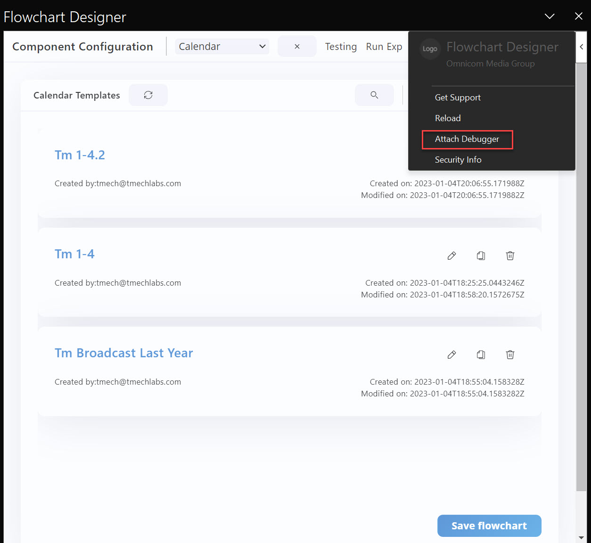
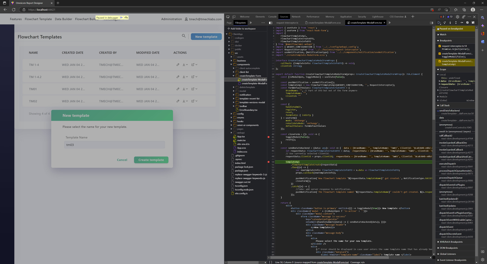
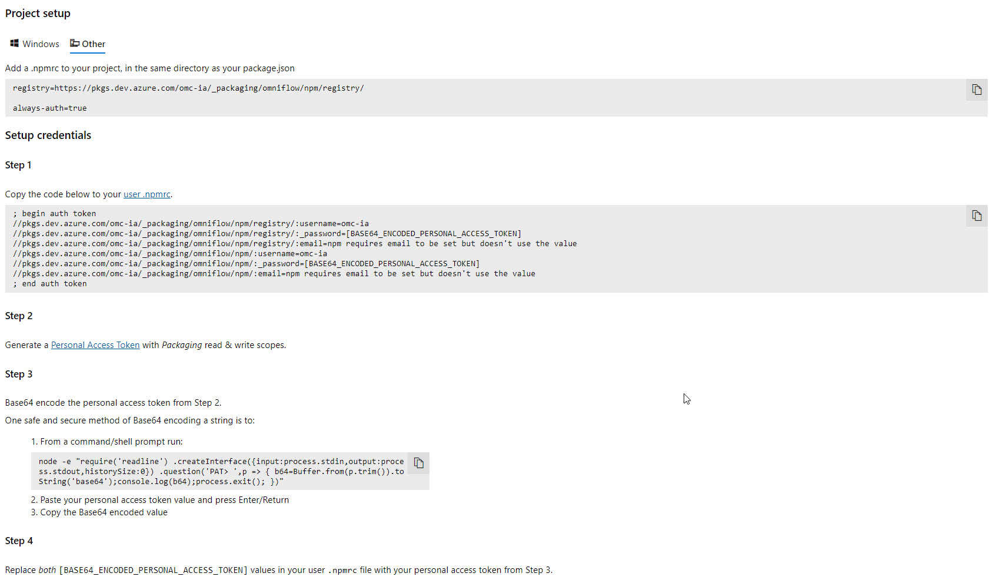
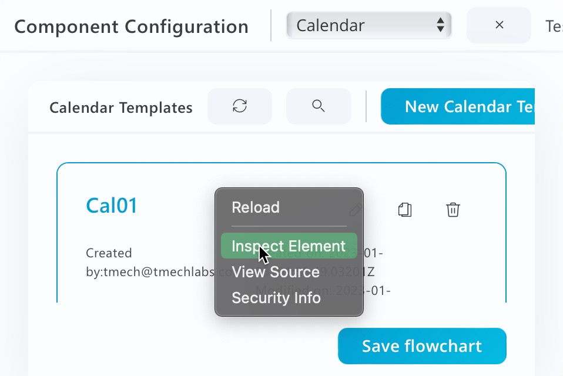
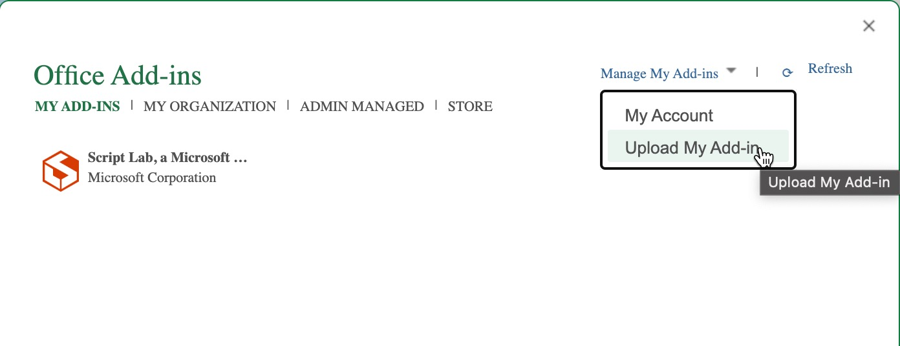
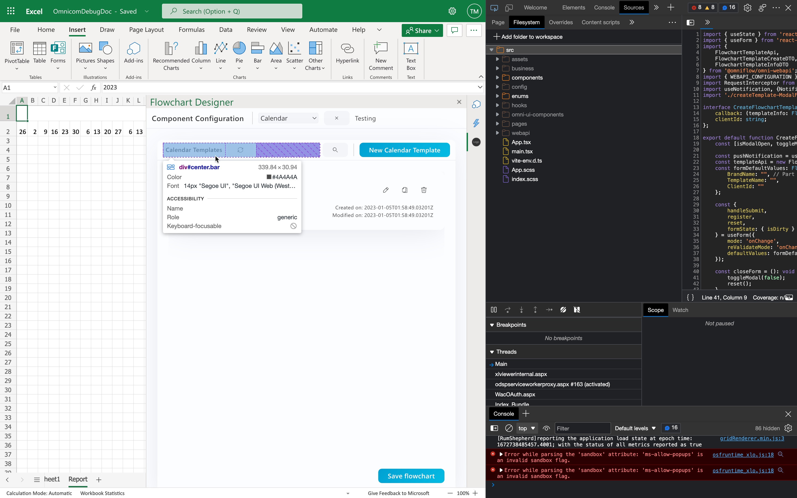
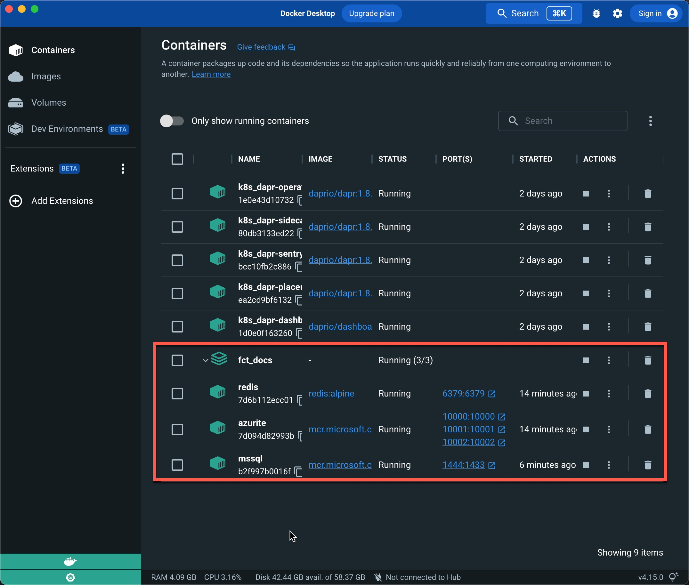
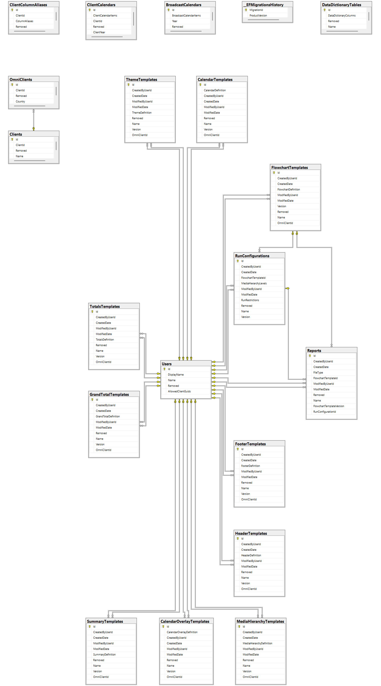
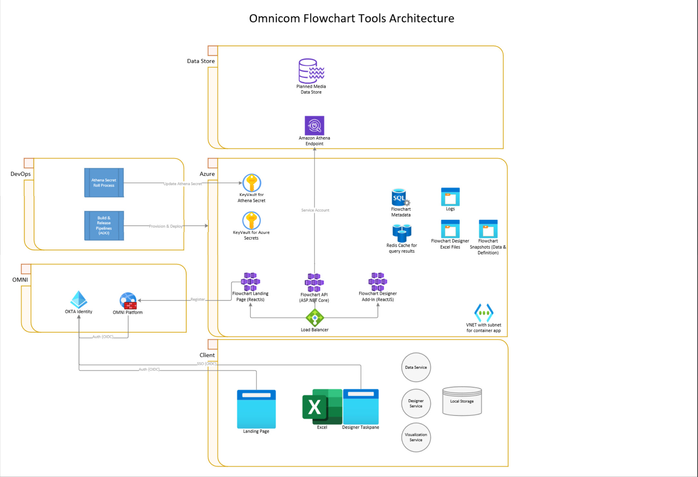
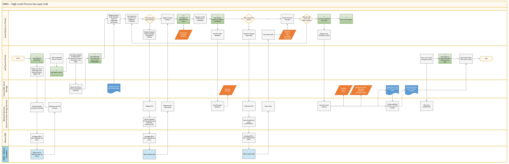

# Flowchart Tools KT Outline

## Project Resources

| Resource             | Description |
|---|---|
| [Flowchart Tools Repo]((https://bitbucket.org/annalect/flowchart_tools/src/master/)) | Code repo for flowchart tools |
| [OMG BaF Automation](https://dev.azure.com/omc-ia/OMG%20BaF%20Automation) | Status, design discussions, demo recordings |
| [OMG BaF Automation](https://dev.azure.com/omc-ia/OMG%20BaF%20Automation) | User stories, bugs, build and deployment pipelines, artifact feed for JavaScript API |
| [Architecture Diagram](https://oneomnicom.sharepoint.com/:u:/r/sites/OMGNAxMSFTPilot/Shared%20Documents/General/03.%20Development%20%26%20Solution%20Design/Architecture/OMG%20-%20High%20Level%20Process%20By%20Tech-v4.vsdx?d=wcf152b2bfe19471f91acb066c4cae089&csf=1&web=1&e=yEHFBj) | Process flow, component diagram & Athena Secret Roll Process |
| Developer VM with Athena Access | OMCMUE1-IADV-02.omc.oneds.com |

## Repository Structure

## Debug Setup

### Prerequisites

#### Required Permissions and Access Configurations

- Request `Contributor` access to code repository [flowchart_tools on Bitbucket](https://bitbucket.org/annalect/flowchart_tools/src/master/)
- Request `Read` access to code repository [omni-ui](https://bitbucket.org/annalect/omni-ui/src/master/)
- Request `Contributor` access to Azure DevOps project [OMG BaF Automation](https://dev.azure.com/omc-ia/OMG%20BaF%20Automation)
- Request `Contributor` access to Azure Dev/QA resource group [OMN-MUE1-RG01-DEV-OMG](https://portal.azure.com/#@oneomnicom.com/resource/subscriptions/2037140b-5f66-431c-bdeb-9887110b8b15/resourceGroups/OMN-MUE1-RG01-DEV-OMG/overview)
- Request `Contributor` access to SharePoint site [BaF Tranche (External - MCS Flowcharts)](https://oneomnicom.sharepoint.com/sites/OMGNAxMSFTPilot/Shared%20Documents/Forms/AllItems.aspx?RootFolder=%2Fsites%2FOMGNAxMSFTPilot%2FShared%20Documents%2FGeneral&FolderCTID=0x0120006D2B8DC879A6584E8ED5EB55ABF96405)
- Ensure you are enrolled for Okta access to [OneWP.Okta.com](https://onewp.okta.com)
- Request addition to Netskope TAO policy to access Dev/QA endpoints for [Landing Page](https://omnicom-report-designer-portal.ashyfield-b8cf8c34.eastus.azurecontainerapps.io/), [Flowchart Designer Add-In](https://omnicom-report-designer-designer.ashyfield-b8cf8c34.eastus.azurecontainerapps.io/) and [Flowchart Designer API](https://omnicom-report-designer-backend.ashyfield-b8cf8c34.eastus.azurecontainerapps.io/swagger/index.html)
- Request addition to Netskope policy to access [Developer VM subnet](https://portal.azure.com/#@oneomnicom.com/resource/subscriptions/2037140b-5f66-431c-bdeb-9887110b8b15/resourceGroups/OMN-MUE1-RG01-DEV-NET/providers/Microsoft.Network/virtualNetworks/OMN-MUE1-RG01-DEV-NET-VN01/subnets) with access to Athena endpoint
- Request access to [Flowchart Tools Dev Omni instance](https://devomni.annalect.com/449203c6-7ed3-11e8-8b6b-0a35455287ac/my-workspace)

### User Stories and Bugs

[Backlog](https://dev.azure.com/omc-ia/OMG%20BaF%20Automation/_backlogs/backlog/OMG%20BaF%20Automation%20Team/Stories)

### Dev/QA Build Pipeline

[Build Pipeline Definition](./azure-pipelines.yml)
[Build Pipeline in ADO](https://dev.azure.com/omc-ia/OMG%20BaF%20Automation/_build?definitionId=5)

### Dev/QA Release Pipeline

[Release Pipeline in ADO](https://dev.azure.com/omc-ia/OMG%20BaF%20Automation/_release?_a=releases&view=mine&definitionId=2)

### Dev/QA Instance

[Resource Group](https://portal.azure.com/#@oneomnicom.com/resource/subscriptions/2037140b-5f66-431c-bdeb-9887110b8b15/resourceGroups/OMN-MUE1-RG01-DEV-OMG/overview)
[Portal Link](https://omnicom-report-designer-portal.ashyfield-b8cf8c34.eastus.azurecontainerapps.io)

### Development Tools

- Visual Studio 2022 for Backend
- Visual Studio Code, WebStorm or similar for Frontend
- NodeJS 16
- Docker Desktop
- Fiddler or similar to debug http traffic
- Postman or similar to test WebAPI
- SQL Server Management Tools, Azure Data Studio or similar to access SQL Server DB
- PowerBI and/or Excel for query design and validation of Athena data and Excel output

### Technology Stack

#### Infrastructure Services

- Azure Container Apps (2-4 GB RAM, 2 Cores per container instance. Can scale down to 0 instances (wake up time approx 25-45s))
- Azure SQL Database (2 GB storage should suffice for the foreseeable future, small-medium compute should suffice for pilot phase. Revisit when user base grows.
- Azure Blob Storage (cross region redundancy)
- Redis Cache (small size for pilot phase 8GB-16GB)
- Azure KeyVault

#### [Web API](./WebAPI/)

- .NET Core 6 (likely will update to v7 before the end of the project due to improved JSON support in EF Core 7)
- ASP.NET Core 6
- Entity Framework Core 6 (likely will update to v7 because of improved JSON support)
- AutoMapper 12
- Lamar (Dependency injection)
- ZiggyCreatures.FusionCache (in memory cache)
- Swashbuckle (Open API/Swagger)
- Okta.AspNetCore

#### Data Access (Flowchart Metadata)

- Entity Framework Core 6 (likely will update to v7 before the end of the project due to improved JSON support in EF Core 7)
- EF Core Migrations
- Microsoft SQL Server

#### [Athena Query Engine (Lib.Athena)](./Lib.Athena/)

- AWS SDK for Athena v3.7.101.6

#### [Portal](./PortalApp/ClientApp/)

- React 17.0.2
- Okta-React
- [PortalApp/ClientApp/package.json](PortalApp/ClientApp/package.json)

#### [Designer Add-In](./DesignerApp/TaskPane/)

- React 17.0.2
- [DesignerApp/TaskPane/package.json](DesignerApp/TaskPane/package.json)

### Common Tasks

#### Cloning the repo

1. Install Git
1. ` git clone https://tmech@bitbucket.org/annalect/flowchart_tools.git `

#### Pushing to the repo

1. [Create ssh key for use with Bitbucket](https://support.atlassian.com/bitbucket-cloud/docs/configure-ssh-and-two-step-verification/)
1. Upload the public key to [your Bitbucket account](https://bitbucket.org/account/settings/ssh-keys/)

#### Install Entity Framework Tools

In order to execute Entity Framework migrations locally install run the following from a shell:

`dotnet tool install --global dotnet-ef`

It `dotnet-ef` is used by the `./migrate.sh` script can be used to update the local database on demand from the `./WebAPI` project with `dotnet-ef database update`.

### Debugging on Windows

#### One-Time Setup Steps

##### Configure Access to Azure DevOps npm Feed

1. Install Azure DevOps npm auth

``` bash
npm install -g vsts-npm-auth
cd Portal/ClientApp
vsts-npm-auth -C .npmrc
```

1. Add the following to the global .npmrc file:

``` bash
@omniflow:registry=https://pkgs.dev.azure.com/omc-ia/_packaging/omniflow/npm/registry/ 
```

#### Starting Debug Session on Windows

1. Ensure you have `Docker for Windows` installed and running
1. Ensure you have `Visual Studio 2022` installed
1. Ensure you have Excel installed
1. Open the root folder of the repo in Git Bash
1. Enable script execution for bash files with ` chmod 755 *.sh `
1. Execute ` ./reset.sh ` which will run `npm install` for the frontend apps, start the containers with storage services and create the backend database on its container
1. Open the solution `OMG Report Designer.sln` in Visual Studio 2022
1. Right-click on the solution in Solution Explorer
1. Select `Configure Startup Projects`
1. Select `Start` for projects `WebAPI`, `PortalApp` and `DesignerApp`
1. Set breakpoints in Web API as needed
1. Start Debugger (F5)

This will launch browser windows for

- Portal App
- Designer App
- Web API

Portal App and Task Pane will prompt for a development configuration with Okta.

Visual Studio will also launch Excel with the embedded Add-In. This Excel session can be minimimized but must remain open for the duration of the debug session.

You can set break points in Visual Studio only for the WebAPI. For the frontend apps, we found it best to use the browser dev tools in Edge or Chrome.

The Excel add-in task pane has an option to attach a debugger to the running add-in which will open the Edge (Chromium) dev tools in a separate window.



Within the browser dev tools it is possible to link the workspace to the root folder containing the TypeScript source code and set breakpoints there. For Portal app that is `./PortalApp/ClientApp/src`. For the Excel Add-In that is `./DesignerApp/TaskPane/src`.

Alternatively, it's always possible to set breakpoints in the compiled JavaScript and the browser tools will find the corresponding source file via code maps.



#### Local and disconnected development machine

On a machine that is not connected to the Omnicom network via Netskope, it is not possible to connect to the Athena endpoint directly. To test the application with data, you have to set the `UseSampleData` setting to `true` in file [`WebAPI/appsettings.json`](./WebAPI/appsettings.json)

#### Local and connected to Omnicom Network (NetSkope)

On a machine connected to the Omnicom network via Netskope you will be able to access the Athena endpoint if the following prerequisites are in place:

- You are added to a Netskope policy that provides access to the endpoint
- You have access to the Azure KeyVault that contains the secret key OR you add the secret key as an environment variable `AWSCredentialConfig_SecretKey` for the WebAPI to use during debugging.

If you don't have access to the Athena endpoint, follow the instructions in section 'Local and disconnected'

### Debugging on Mac

#### Configure Access to Azure DevOps npm Feed on Mac

To access the Azure DevOps artifacts feed, a personal access token (PAT) must be configured in the `~/.npmrc` file in the user's home folder.

The latest instructions can be found in Azure DevOps. [Follow the guide for "Other"](https://dev.azure.com/omc-ia/OMG%20BaF%20Automation/_artifacts/feed/omniflow/connect/npm)

Here's a 

#### Start a Debug Session on Mac

1. Ensure you have [`Docker for Mac`](https://docs.docker.com/desktop/install/mac-install/) installed and running
1. Ensure you have `Visual Studio 2022` installed
1. Ensure you have Excel installed ()
1. Enable Excel Add-in developer features by running `defaults write com.microsoft.Excel OfficeWebAddinDeveloperExtras -bool true` in a shell
1. Open the root folder of the repo in Git Bash
1. Enable script execution for bash files with `chmod 755 *.sh`
1. Execute ` ./reset.sh ` which will run `npm install` for the frontend apps, start the containers with storage services and create the backend database on its container. (Sometimes `the migrate.sh` fails with a connection error to the mssql container. In that case running `./migrate.sh` again usually succeeds.)
1. Open the solution `OMG Report Designer.sln` in Visual Studio 2022
1. Right-click on the solution in Solution Explorer
1. Select `Configure Startup Projects`
1. Select `Start` for projects `WebAPI`, `PortalApp` and `DesignerApp`
1. Set breakpoints in Web API as needed
1. Start Debugger (F5)

Portal App and Task Pane will prompt for a development configuration with Okta.

You can set break points in Visual Studio only for the WebAPI. For the frontend apps, we found it best to use the browser dev tools in Edge or Chrome.

The HTML content rendered in the Excel task pane can be debugged using the right-click option `Inspect Element` which will open the Safari web inspector. It doesn't have some of the niceties of Chrome or Edge Developer tools but can be used to set breakpoints in the JavaScript and debug issues that only arise in Safari.



It's also possible to use Chrome or Edge to debug the add-in. This approach requires loading an Excel file with the embedded add-in in Excel Online. To do that follow these steps:

1. Create a new template from the portal app or open an existing one from the portal app
1. Open the downloaded template file in Excel
1. Save the file to OneDrive
1. Open OneDrive in online view
1. Open the saved template file in Excel Online
1. Insert the [add-in manifest](./DesignerApp/TaskPane/manifest.xml)
1. Open browser developer tools (F12)





Within the browser dev tools it is possible to link the workspace to the root folder containing the TypeScript source code and set breakpoints there. For Portal app that is `./PortalApp/ClientApp/src`. For the Excel Add-In that is `./DesignerApp/TaskPane/src`.

Alternatively, it's always possible to set breakpoints in the compiled JavaScript and the browser tools will find the corresponding source file via code maps.

To launch the Excel Add-In on Mac an additional step is required.
//TODO
https://oneomnicom.sharepoint.com/:x:/r/sites/OMGNAxMSFTPilot/Shared%20Documents/General/03.%20Development%20%26%20Solution%20Design/UI%20Assets/Debug.xlsx?d=weae0337e40824fc1ad4b23bab12917d2&csf=1&web=1&e=GrJi6Z

### Portal App Start

> Office React AddIn

`PortalApp\ClientApp\package.json`

```bash
cd PortalApp/ClientApp
npm install
npm run dev
```

### Designer App Start

> Portal written using React and Vite

`DesignerApp\TaskPane\package.json`

```bash
cd DesignerApp/TaskPane
npm install
npm run start
```

### Web API Client Generation and Publishing

When the backend Web API changes and the frontend has a dependency on the latest changes, it is necessary to generate the TypeScript client for the Web API and publish it to the npm feed.

To do that, follow these steps:

1. Start WebAPI
1. Open ./PortalApp/ClientApp/package.json and increment the version number in in command „codegen“ -> --additional-properties=npmVersion=0.0.nn (to nn+1)
1. Execute `npm run codegen:update-openapi-file`
1. Execute `cp ./.npmrc src/webapi/` OR create a new `.npmrc` file in src/webapi with mapping of the `@omniflow` package prefix to the registry you want to publish to (make sure you have configured a PAT for it in ~/.npmrc)
1. `cd ./PortalApp/ClientApp/src/webapi`
1. Execute npm run codegen:package
1. Open package.json for `/DesignerApp/TaskPane` and `/PortalApp/ClientApp` to update the version number for `"@omniflow/omni-webapi": "^0.0.nn" to the new version from step 2
1. Execute `npm Install`

## Troubleshooting Local Setup

### Certificate errors

Office Add-Ins require TLS encryption by default. In debug environments the tooling will generate self-signed certificates with relatively short expiration periods. 

If you are getting certificate errors in the browser or add-in task pane, delete the certificates. They will be regenerated on the next run.

```bash
rm -rf ~/.office-addin-dev-certs/*
```

### Start Storage Services

1. Open shell
1. Go to root folder of the repo
1. Enable execution on all shell scripts (with .sh extension) by running `chmod 755 *.sh`
1. Run `./start-services.sh`

### Wrong Excel Add-In version loads after manifest update

Clear the Office cache by following [these instructions](https://learn.microsoft.com/en-us/office/dev/add-ins/testing/clear-cache)

### Running `./reset.sh` results in SQL connection error

Typically, this is the result of a race condition between starting up SQL Server on the mssql container and executing the migrations. In most cases running `./migrate.sh` after a failed `./reset.sh` run succeeds. If not, verify if the mssql container is running in Docker Desktop.



## Deployment

### Pipelines

[Build Pipeline (MCS)](https://dev.azure.com/omc-ia/OMG%20BaF%20Automation/_apps/hub/ms.vss-build-web.ci-designer-hub?pipelineId=5&nonce=Hfu5wIRkdhGdH153rnH%2BIA%3D%3D&branch=develop)
[Release Pipeline (MCS)](https://dev.azure.com/omc-ia/OMG%20BaF%20Automation/_releaseDefinition?definitionId=2&_a=environments-editor-preview)

### Troubleshooting

The pipelines have been fairly reliable. There were two instances of build issues that required a tweak:

#### Out of Heap Memory Error

By default the npm runtime allocates 2GB to the heap. That limit was breached recently. The fix was to increase the heap memory for node using the `NODE_OPTIONS` environment variable in the `npm run build` command line following command:

`cd ./DesignerApp/TaskPane/ && export NODE_OPTIONS=--max-old-space-size=4096 && npm run build`

#### Module not found in Build Pipeline

We recently faced a build break that was somewhat difficult to track down. `npm run build` was running fine on Mac and Windows machines but the build pipeline failed. The error manifested as a `module not found` error. The issue was a inconsistent casing in the source code that was handled silently by `npm run build` on Windows and Mac but not on Linux.

As a general guide when noticing different behaviors between dev machine and build pipeline, try running `npm run build` on a Linux VM or WSL (Windows Subsystem for Linux) for a local repro.

### Azure Services

#### Database

Azure SQL Database holds:

- flowchart template data
- component template data
- calendar data
- data dictionary snapshots (refreshed hourly)
- client mapping tables



#### Container Apps

- Hosting for Web API
- Hosting for Portal App
- Hosting for Designer App

Can be scaled out based on usage and scaled down to 0 when not in used (incurs ~1 minute boot up time from cold start)

#### Redis

- Caches query results

### Build Pipeline

See above. Has already been reimplemented by Annalect

### Release Pipeline

See above. Has already been reimplemented by Annalect
### DEV/QA Environment Info

Has already been reimplemented by Annalect

MCS environment is here:

[Resource Group](https://portal.azure.com/#@oneomnicom.com/resource/subscriptions/2037140b-5f66-431c-bdeb-9887110b8b15/resourceGroups/OMN-MUE1-RG01-DEV-OMG/overview)
[Portal Link](https://omnicom-report-designer-portal.ashyfield-b8cf8c34.eastus.azurecontainerapps.io)

## Architecture

### Overview

The application is implemented in 3 major parts:

- Portal App
- Designer App
- Web API

The Portal App is the entry point for end users and integrated with Omni. Users can manage flow chart templates from there and generate updated renderings. The edit and launch experience will take the user into the Designer Excel Add-In.

The Excel add-in implements the edit/configuration UI as well as the run experience where users can parameterize the rendering of a report. User can create and assemble component templates into a flowchart and save all templates to the backend. In the run/publish experience users can constrain the flowchart configuration using parameters for calendar time frame media hierarchy and global filters (config UI not yet implemented).

Both frontend applications are implemented with React using Omni UI components where possible. Both frontend applications connect to the same Web API backend implemented with ASP.NET Core.

The Web API can operate connected or disconnected from the Athena data endpoint. When disconnected using the `UseSampleData` configuration setting, the API will access a sample data snapshot instead of sending queries to Athena. This was done to enable disconnected local development and to buffer the test environments from data model changes in the Planit data store.

#### Component Diagram


[Living Document](https://oneomnicom.sharepoint.com/:u:/r/sites/OMGNAxMSFTPilot/Shared%20Documents/General/03.%20Development%20%26%20Solution%20Design/Architecture)

#### Process Flow Diagram


[Living Document](https://oneomnicom.sharepoint.com/:u:/r/sites/OMGNAxMSFTPilot/Shared%20Documents/General/03.%20Development%20%26%20Solution%20Design/Architecture)

### Backend

#### Data Access

The original implementation was using Okta for authentication. Annalect is now in the process of shifting to SSO2 in order to be able to handle user sessions and required session information for the add-in more easily and securely.

The authorization model is fundamentally based on access to Omnicom Client IDs.

Within the application and within a client's dataset users can only modify the templates they created. They can copy and modify other users' templates.

##### Athena Integration

[Implemented here](https://bitbucket.org/annalect/flowchart_tools/src/develop/Lib.Athena/)

##### Querying & Caching

The app downloads all client data and caches it in Redis in order to reduce the number of round trips between the designer and Athena endpoints.

###### Sample Data

When in the [`UseSampleData`](https://bitbucket.org/annalect/flowchart_tools/src/master/WebAPI/appsettings.json) mode (line 49), all queries are directed at a snapshot of sample data for one client. 
The data files are located in [Lib.SampleData/Content](https://bitbucket.org/annalect/flowchart_tools/src/develop/Lib.SampleData/Content/)
They were produced using the download function of the [AthenaQueryTool](https://bitbucket.org/annalect/flowchart_tools/src/develop/AthenaQueryTool/) from the live Athena endpoint

##### Live Data

When `UseSampleData` is set to true, the API will send queries to Athena and process the results into a cacheable format similar to the SampleData. In order to run in this mode, the development machine or test environment has to have network connectivity to the Athena endpoint and the correct Athena credentials configured.

##### Flowchart Snapshots

Flowchart snapshots are generated when a user publishes a new report. The output is stored in Azure Blob Storage.
Each snapshot contains:

- the current flowchart definition at the time of publishing
- data snapshot used to render the report
- run configuration parameters
- Excel file with the output of the rendering

#### Web API

[Web API](https://bitbucket.org/annalect/flowchart_tools/src/develop/WebAPI/)
[Web API Logic](https://bitbucket.org/annalect/flowchart_tools/src/develop/Lib.WebAPI/)

#### Frontend

##### Landing Page

[Portal App](https://bitbucket.org/annalect/flowchart_tools/src/develop/PortalApp/)

###### Flowchart Template Management

Each time a flowchart template is saved, the JSON conten of the flowchart template is updated. We are not tracking versions for each save. Versions are only generated when a report is published. Flowchart definitions are output format agnostic and capture generic configuration information about a flowchart report. The definition can be processed by

###### Flowchart Snapshot Management

Each time a flowchart report is published, a report record is created in the Reports table and the corresponding snapshots are saved to blob storage.
From the landing page, versions used to create a published report can be restored to be the current version of the flowchart template. In that case the template from the snapshot is copied into the FlowchartTemplate JSON content.

##### Excel Add-In

https://bitbucket.org/annalect/flowchart_tools/src/develop/DesignerApp/

###### Component Template Config UI

Each component implements its own configuration UI under [src/pages](https://bitbucket.org/annalect/flowchart_tools/src/develop/DesignerApp/TaskPane/src/pages/)

You will notice different implementation styles due to parallel development and different needs by different components. There is opportunity for refactoring of common pieces. At this point Calendar, Footer, and Header follow one style, Media Hierarchy, Grand Totals, Right-Hand Totals, Calendar Overlay and Themes follow another style.

###### Excel Rendering

The [rendering engine](https://bitbucket.org/annalect/flowchart_tools/src/develop/DesignerApp/TaskPane/src/business/engine/) is based on the concepts of 

- [blocks](https://bitbucket.org/annalect/flowchart_tools/src/develop/DesignerApp/TaskPane/src/business/engine/blocks/) which represent the different stylable components of a flowchart report
- [builders](https://bitbucket.org/annalect/flowchart_tools/src/develop/DesignerApp/TaskPane/src/business/engine/builder/) which assemble blocks for specific report sections and
- [renderers](https://bitbucket.org/annalect/flowchart_tools/src/develop/DesignerApp/TaskPane/src/business/engine/renderer/) which produce a format specific renderings. For this project only the excel renderer has been implemented.

Blocks are defined generically and generated and assembled by builder components that are specific to a report section (e.g. header, media hierarchy or calendar). The render engine will call each builder for all the components present in a given flowchart definition to acquire the block layouts, merge them and apply any additional styling. Up to this point the render engine is generic and can be connected to renderers that produce different output formats (HTML, Power BI, PDF, etc).

###### Run Experience

The [Run Experience](https://bitbucket.org/annalect/flowchart_tools/src/develop/DesignerApp/TaskPane/src/runXP/components/) implements parameterization and publishing features in the designer app.

There are a few outstanding issues in ADO:
[#928 Global Filter UI](https://dev.azure.com/omc-ia/OMG%20BaF%20Automation/_queries/edit/928/?triage=true)
[#936 Navigation to Run experience from Landing Page](https://dev.azure.com/omc-ia/OMG%20BaF%20Automation/_queries/edit/936/?triage=true)

###### Save Flowchart Template to Backend

###### Test Mode

The [test mode](https://bitbucket.org/annalect/flowchart_tools/src/develop/DesignerApp/TaskPane/src/testMode/) allows developers to create test cases against the render engine and automatically compare expected rendering with actual rendering. It supports component based testing for all components (media hierarchy includes right-hand grand totals, calendar includes calendar overlays) or whole reports.

Test cases and expected results are stored in [TaskPane/assets/tests](https://bitbucket.org/annalect/flowchart_tools/src/develop/DesignerApp/TaskPane/assets/tests/)

[testConfig.json](https://bitbucket.org/annalect/flowchart_tools/src/develop/DesignerApp/TaskPane/assets/testConfig.json) contains the list of active test cases from the set of tests in `assets/tests`

In local development mode the test mode can be accessed from the Designer App Task pane.